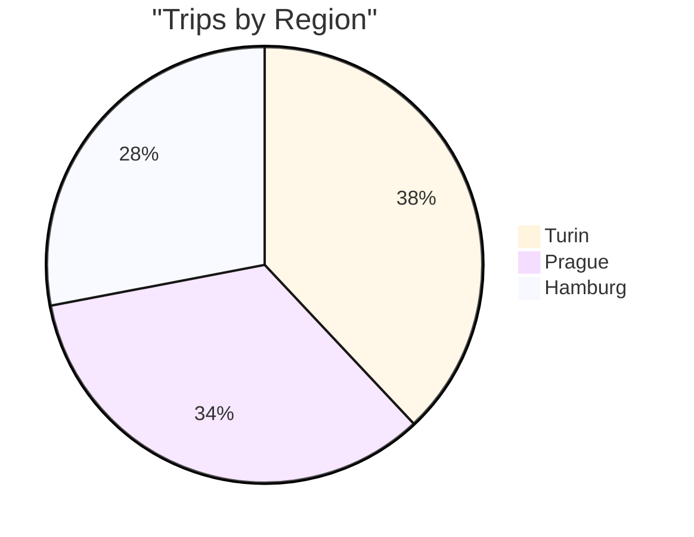
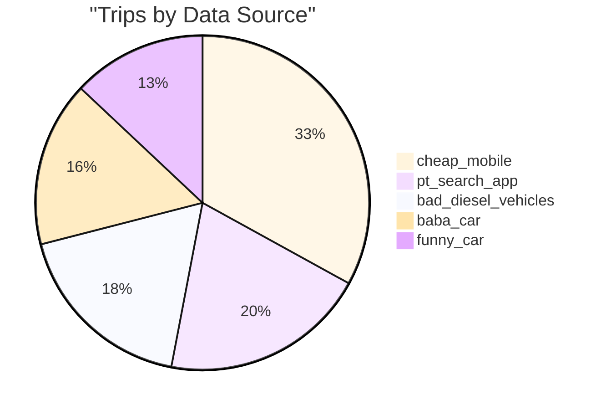
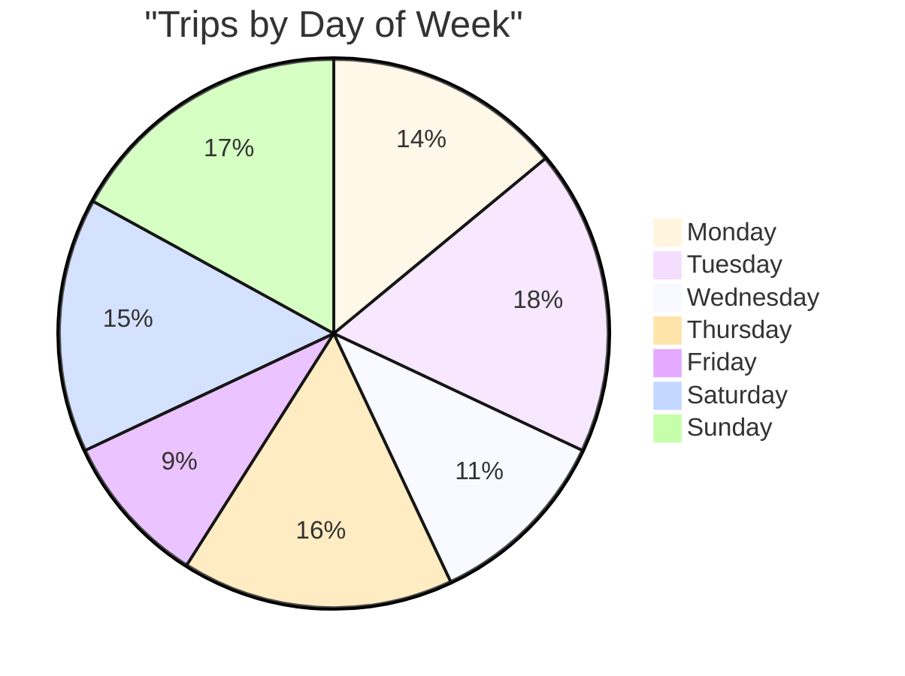
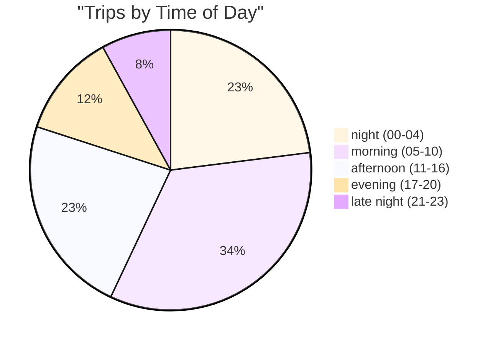

# Sample Data Exploratory Analysis (trips.csv)

## Summary

- Total trips: **100**
- Regions: **Hamburg, Prague, Turin**
- Data sources: **baba_car, bad_diesel_vehicles, cheap_mobile, funny_car, pt_search_app**
- Time range: **2018-05-01 05:24:37** to **2018-05-31 11:59:33**
- ISO weeks covered: **18, 19, 20, 21, 22** (total of 5 weeks)

## Distribution by region

| Region | Trips | Weekly average (5 weeks) |
| --- | --- | --- |
| Hamburg | 28 | 5.6 |
| Prague | 34 | 6.8 |
| Turin | 38 | 7.6 |
| **Total** | **100** | **20.0** |

### Chart (pie)



## Distribution by data source

| Source | Trips |
| --- | --- |
| cheap_mobile | 33 |
| pt_search_app | 20 |
| bad_diesel_vehicles | 18 |
| baba_car | 16 |
| funny_car | 13 |

### Chart (pie)



## Region x data source

| Region | baba_car | bad_diesel_vehicles | cheap_mobile | funny_car | pt_search_app |
| --- | --- | --- | --- | --- | --- |
| Hamburg | 7 | 4 | 10 | 5 | 2 |
| Prague | 4 | 6 | 13 | 4 | 7 |
| Turin | 5 | 8 | 10 | 4 | 11 |

## Temporal distribution

### By day of week

| Day | Trips |
| --- | --- |
| Monday | 14 |
| Tuesday | 18 |
| Wednesday | 11 |
| Thursday | 16 |
| Friday | 9 |
| Saturday | 15 |
| Sunday | 17 |

#### Chart (pie)



### By time-of-day bucket

| Period | Range | Trips |
| --- | --- | --- |
| night (00-04) | 00-04 | 23 |
| morning (05-10) | 05-10 | 34 |
| afternoon (11-16) | 11-16 | 23 |
| evening (17-20) | 17-20 | 12 |
| late night (21-23) | 21-23 | 8 |

#### Chart (pie)



## Geographic extents (bounding box by region)

Approximate min/max values for **origin** and **destination**. Useful for bounding box queries.

| Region | Origin lon min | Origin lon max | Origin lat min | Origin lat max | Destination lon min | Destination lon max | Destination lat min | Destination lat max |
| --- | --- | --- | --- | --- | --- | --- | --- | --- |
| Hamburg | 9.803049 | 10.215496 | 53.428659 | 53.652201 | 9.789198 | 10.215298 | 53.412072 | 53.654196 |
| Prague | 14.318404 | 14.666893 | 49.989806 | 50.125022 | 14.311993 | 14.665600 | 49.992697 | 50.123356 |
| Turin | 7.513135 | 7.739660 | 44.976125 | 45.139301 | 7.517130 | 7.776839 | 44.981717 | 45.128276 |

## Observations relevant to the challenge

- **Grouping by similar origin, destination, and time**: in the sample, there are no exact origin+destination repeats (0 duplicates). This suggests grouping should use **spatial proximity** (e.g., geohash/H3 or radius-based clustering) and **time bucketing** (e.g., morning/afternoon/night or 15-60 min windows).
- **Weekly averages by area**: the sample covers 5 ISO weeks (18-22). The overall weekly average is **20.0 trips/week**. By region: Hamburg **5.6**, Prague **6.8**, Turin **7.6**.
- **Ingestion status without polling**: the analysis does not enforce it, but the dataset suggests an async flow (e.g., events or WebSocket) to report when batches like May/2018 are processed.
- **Bounding box queries**: the limits above help validate spatial queries and define region-based partitioning.

## Most recent data per region (sample)

| Region | Most recent date/time | Source |
| --- | --- | --- |
| Hamburg | 2018-05-31 11:59:33 | baba_car |
| Prague | 2018-05-29 12:44:02 | cheap_mobile |
| Turin | 2018-05-31 06:20:59 | pt_search_app |

## Suggested SQL queries

The queries below assume a `trips` table with columns:
`region`, `origin_coord`, `destination_coord`, `datetime`, `datasource`.

### 1) Basic distributions

```sql
-- Trips by region
SELECT region, COUNT(*) AS trips
FROM trips
GROUP BY region
ORDER BY trips DESC;

-- Trips by source
SELECT datasource, COUNT(*) AS trips
FROM trips
GROUP BY datasource
ORDER BY trips DESC;
```

### 2) Weekly average by region (ISO week)

```sql
WITH weekly AS (
  SELECT
    region,
    EXTRACT(ISOWEEK FROM datetime) AS iso_week,
    COUNT(*) AS trips
  FROM trips
  GROUP BY region, EXTRACT(ISOWEEK FROM datetime)
)
SELECT
  region,
  AVG(trips) AS avg_weekly_trips
FROM weekly
GROUP BY region
ORDER BY avg_weekly_trips DESC;
```

### 3) Latest source by region

```sql
WITH ranked AS (
  SELECT
    region,
    datasource,
    datetime,
    ROW_NUMBER() OVER (PARTITION BY region ORDER BY datetime DESC) AS rn
  FROM trips
)
SELECT region, datasource, datetime
FROM ranked
WHERE rn = 1
ORDER BY region;
```

### 4) Bounding box (origin and destination) by region

```sql
-- Example with PostGIS; adjust to your DB.
SELECT
  region,
  MIN(ST_X(origin_coord)) AS origin_lon_min,
  MAX(ST_X(origin_coord)) AS origin_lon_max,
  MIN(ST_Y(origin_coord)) AS origin_lat_min,
  MAX(ST_Y(origin_coord)) AS origin_lat_max,
  MIN(ST_X(destination_coord)) AS dest_lon_min,
  MAX(ST_X(destination_coord)) AS dest_lon_max,
  MIN(ST_Y(destination_coord)) AS dest_lat_min,
  MAX(ST_Y(destination_coord)) AS dest_lat_max
FROM trips
GROUP BY region;
```

## Data model sketch (SQL + spatial)

### Goal
Simplify aggregation queries and enable grouping by **spatial proximity** and **time window**, with scalability for high volumes.

### Main tables

1. `trips`
   - `trip_id` (PK)
   - `region_id` (FK)
   - `origin_geom` (POINT)
   - `destination_geom` (POINT)
   - `origin_geohash` (optional)
   - `destination_geohash` (optional)
   - `datetime` (timestamp)
   - `datasource_id` (FK)
   - `ingested_at` (timestamp)

2. `regions`
   - `region_id` (PK)
   - `region_name`
   - `region_geom` (POLYGON) - optional, for defined region queries

3. `datasources`
   - `datasource_id` (PK)
   - `datasource_name`

4. `trip_clusters` (optional materialization)
   - `cluster_id` (PK)
   - `region_id` (FK)
   - `origin_cell` (geohash/H3)
   - `destination_cell` (geohash/H3)
   - `time_bucket` (e.g., hour of day or 15-60 min window)
   - `trip_count`
   - `week` (for weekly averages)

### Recommended indexes

- `trips(datetime)` for time filters and incremental ingestion.
- `trips(region_id, datetime)` for weekly averages by region.
- `trips(origin_geom)` and `trips(destination_geom)` with spatial indexes (GiST in PostGIS).
- `trips(origin_geohash)` and `trips(destination_geohash)` for fast grouping.

### Scalability notes

- Partition `trips` by **month/week** and optionally by **region**.
- Pre-aggregate into `trip_clusters` for faster queries and lower cost.
- Use **geohash/H3** for spatial grouping consistent with the "similar origin/destination" requirement.
