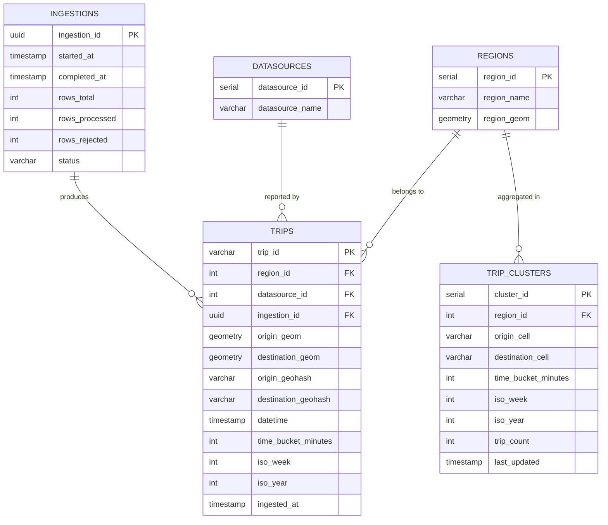

# Architecture Document — Trips Data Engineering Challenge

> **Version**: 1.0 | **Date**: March 2026 | **Author**: José Guilherme

---

## Table of Contents

1. [The Problem](#1-the-problem)
2. [Conceptual Solution](#2-conceptual-solution) *(includes CQRS and Event Sourcing — §2.4)*
3. [How It Works End-to-End](#3-how-it-works-end-to-end)
4. [Solution Structure (C4 Model)](#4-solution-structure-c4-model)
5. [Answering the Challenge Questions](#5-answering-the-challenge-questions)
6. [Data Model](#6-data-model)
7. [Trade-off Analysis (Local Implementation)](#7-trade-off-analysis-local-implementation)
8. [Cloud Architecture: AWS + Databricks + MSK](#8-cloud-architecture-aws--databricks--msk)
9. [Trade-off Analysis (Cloud Implementation)](#9-trade-off-analysis-cloud-implementation)
10. [Conclusion](#10-conclusion)

---

## 1. The Problem

The challenge requires building an **automated, on-demand ingestion process** for trip data. Each trip record contains:

- **Spatial attributes**: city/region, geographic origin (lon/lat), geographic destination (lon/lat)
- **Temporal attribute**: trip datetime
- **Metadata**: datasource identifier

From these raw records, the system must:

| Requirement | Description |
|---|---|
| **R1 — Automated Ingestion** | Ingest CSVs on demand, storing data persistently in a SQL database |
| **R2 — Similarity Grouping** | Group trips with similar origin, destination, and time-of-day |
| **R3 — Weekly Averages** | Expose weekly average trip counts, filterable by bounding box or region name |
| **R4 — Non-polling Status** | Inform clients about ingestion progress without them needing to poll repeatedly |
| **R5 — Scalability** | Handle up to **100 million records** with proof of scalability |
| **R6 — SQL Database** | All final data must be queryable via SQL |

### Why This Is Non-Trivial

A naive solution — load the CSV into a single database table — fails at scale for several reasons:

- **100M rows** in a single PostgreSQL table without partitioning leads to sequential scans and degraded query performance.
- **Spatial grouping** ("similar origin and destination") cannot be done with exact equality: the sample data has zero exact coordinate duplicates. A proximity-based strategy (geohash, H3, or radius) is required.
- **Non-polling status** requires an event-driven architecture, not a simple HTTP endpoint that returns a status field.
- **On-demand ingestion** implies the system must be ready to receive and process uploads at any time, concurrently, without blocking the API caller.

---

## 2. Conceptual Solution

The solution is built around three core design principles:

### 2.1 Event-Driven Ingestion

Instead of loading CSVs directly into the database, **each CSV row becomes a discrete event** published to a message queue (Apache Kafka). This decouples ingestion speed from processing speed and provides natural backpressure, replay capability, and an audit trail.

```
CSV Upload → REST API → 1 Kafka event per row → async processing
```

### 2.2 Medallion Architecture (Bronze / Silver / Gold)

Processing follows the **lakehouse medallion pattern**:

| Layer | What It Contains | Purpose |
|---|---|---|
| **Bronze** | Raw, unmodified events from Kafka | Immutable audit trail; enables full reprocessing |
| **Silver** | Validated, deduplicated, normalized records | Clean dataset for analytical queries |
| **Gold** | Pre-aggregated clusters and metrics | Fast, cheap query layer for the serving tier |

This separation means a data quality bug in Silver can be fixed by reprocessing only that layer, without touching Bronze or re-ingesting from the source.

### 2.3 Streaming as the Primary Processing Paradigm

Rather than scheduled batch jobs, **Spark Structured Streaming** continuously consumes new events and updates downstream layers. This provides:

- **Low latency**: records appear in PostgreSQL within seconds of ingestion
- **Scalability**: adding Spark workers linearly increases throughput
- **Fault tolerance**: checkpointing enables exactly-once semantics and automatic recovery
- **Simplicity**: the same streaming code scales from the 100-row sample to 100M records

### 2.4 Architectural Patterns: Adapted CQRS and Event Sourcing

This architecture applies two well-known enterprise patterns in a **pragmatic, adapted form** — capturing their core benefits without the full formal overhead that would be unnecessary at this scale and access pattern.

**Event Sourcing (adapted)**

In formal Event Sourcing, every state change is persisted as an immutable event, and current state is derived by replaying those events. This architecture applies the same principle through Kafka: each CSV row becomes a discrete, immutable event published to `trips.raw`. With configurable retention, the topic serves as a durable event log that enables full reprocessing from any point in time. The Medallion layers (Bronze → Silver → Gold) are exactly the projections of this event log at different refinement levels — Bronze is the raw projection, Silver is the validated projection, Gold is the aggregated projection.

A formal Event Sourcing implementation would add explicit aggregate roots, an event store, and projection rebuild tooling. That overhead is not justified here: Kafka's built-in offset management and Delta Lake's time-travel capability already cover the replay and audit requirements without additional infrastructure.

**CQRS (adapted)**

Command Query Responsibility Segregation separates the write model from the read model. This architecture implements that separation natively:

- **Write path (Command side)**: `REST API → Kafka → Spark Job 1 → Spark Job 2 → PostgreSQL` — optimized for throughput, fault tolerance, and idempotency.
- **Read path (Query side)**: `REST API → PostgreSQL (Gold layer / trip_clusters)` — optimized for low-latency geospatial queries via pre-aggregated tables and GiST indexes.

The two paths never share a code path and scale independently: write throughput is governed by Kafka partitions and Spark workers; read throughput is governed by PostgreSQL connection pooling and read replicas. A formal CQRS implementation would introduce explicit read-model synchronization contracts and eventual-consistency visibility guarantees for clients. That is unnecessary here because the access pattern is simple (queries by region and week), the consistency window is already defined by the Spark micro-batch interval, and there is no competing write/read contention on the same records.

---

## 3. How It Works End-to-End

### 3.1 Overall Flow


**Reading this diagram:** The flow is fully asynchronous. The client uploads a CSV and immediately receives an `ingestion_id` (HTTP 202); the API never blocks waiting for processing to finish. Each CSV row becomes an independent Kafka event, allowing Spark to consume and process records in parallel without any coupling to upload speed. Invalid rows are diverted to a Dead Letter Queue (`trips.dlq`) rather than failing the entire batch, preserving partial results. Airflow acts as a watchdog: it submits both Spark jobs and restarts them on failure, ensuring the streaming pipelines stay alive without manual intervention. The feedback loop at the bottom — Spark jobs publishing to `ingestion.status`, the API consuming those events and forwarding them via SSE — is what satisfies the non-polling requirement: the client is notified proactively at each pipeline milestone.

### 3.2 Step-by-Step Walkthrough

**Step 1 — CSV Upload**

The client sends a `POST /ingestions` request with a CSV file. The API returns an `ingestion_id` immediately (HTTP 202 Accepted) and begins publishing events asynchronously.

**Step 2 — Event Publishing**

The API parses the CSV row by row. For each valid row, it publishes a JSON event to the `trips.raw` Kafka topic. Invalid rows go to `trips.dlq` (Dead Letter Queue) for later inspection. The event schema includes:

```json
{
  "ingestion_id": "3fa85f64-5717-4562-b3fc-2c963f66afa6",
  "row_number": 42,
  "trip_id": "sha256(region|origin_lon|origin_lat|dest_lon|dest_lat|datetime)",
  "region": "Prague",
  "origin_lon": 14.4973794,
  "origin_lat": 50.0013687,
  "destination_lon": 14.4310948,
  "destination_lat": 50.0405293,
  "datetime": "2018-05-28T09:03:40Z",
  "datasource": "funny_car"
}
```

The `trip_id` is a deterministic hash of the trip's business key (excluding `ingestion_id`), enabling deduplication across repeated uploads.

**Step 3 — Bronze + Silver (Spark Job 1)**

Spark Structured Streaming continuously reads from `trips.raw`:
- Writes the raw payload to the **Bronze** Delta table (schema-on-read, full audit)
- Validates types, normalizes coordinates and datetimes, drops rows that fail validation
- Deduplicates by `trip_id` with a watermark window (e.g., 24h)
- Writes clean records to the **Silver** Delta table
- Publishes status events (`STARTED`, `IN_PROGRESS`, `COMPLETED`, `FAILED`) to `ingestion.status`

**Step 4 — Gold + PostgreSQL (Spark Job 2)**

A second Spark Structured Streaming job reads from Silver:
- Computes geohash cells for origin and destination (precision 7 ≈ 150m × 150m)
- Assigns 30-minute time buckets
- Groups trips by `(origin_cell, destination_cell, time_bucket, iso_week)` to produce **trip clusters**
- Incrementally upserts cluster aggregates and trip records into PostgreSQL + PostGIS

**Step 5 — Status Notification**

At each pipeline transition, a status event is published to `ingestion.status`. The API consumes this topic and forwards updates to connected clients via **Server-Sent Events (SSE)**. The client holds a single long-lived HTTP connection and receives push notifications — no polling required.

### 3.3 Ingestion Status Sequence


**Reading this diagram:** This sequence answers requirement R4 — *"inform the user about the status of data ingestion without using a polling solution."* The key insight is that the client opens a **single persistent HTTP connection** (`GET /ingestions/{id}/status`) immediately after receiving the `ingestion_id`. From that point, all status transitions are **pushed** to the client by the server. There is no repeated request; the client just listens. The Kafka `ingestion.status` topic is the coordination bus: every Spark job publishes an event at each milestone (`BRONZE_STARTED`, `SILVER_COMPLETED`, `COMPLETED`), and the API relays those events directly to the client's SSE stream. The `alt` block shows the failure path: even on error, the client receives a notification automatically — Airflow then restarts the job using its existing checkpoint, so processing resumes from exactly where it stopped rather than reprocessing from the beginning.

---

## 4. Solution Structure (C4 Model)

### 4.1 Level 1 — System Context

> Who uses the system and what does it interact with?


**There is one human actor** (the Client) and two external systems. The Client interacts with the platform exclusively via HTTPS and SSE — no direct database access is needed. The platform exposes PostgreSQL's wire protocol to BI tools, which means any SQL-capable tool (Tableau, Metabase, Superset, psql) can connect without any additional adapter. The CSV Source is intentionally external: the platform is agnostic to how CSVs are produced; it only cares about receiving them via the upload endpoint.

### 4.2 Level 2 — Container Diagram

> What are the deployable units and how do they communicate?


**There are seven deployable units**, each running as a separate Docker container. Notice that Kafka appears in three roles simultaneously: it receives events from the API (`trips.raw`, `trips.dlq`), delivers them to Spark Job 1 for processing, and carries status events back to the API (`ingestion.status`). This makes Kafka the **central nervous system** of the platform — every cross-container communication passes through it, which is why no container directly calls another's HTTP API. The only exceptions are Airflow (which uses `spark-submit` to start Spark jobs) and Spark Job 2 (which writes to PostgreSQL via JDBC). Delta Lake is the hand-off point between the two Spark jobs: Job 1 writes Silver, Job 2 reads Silver — they never communicate directly. This design means each job can fail and recover independently without affecting the other.

### 4.3 Level 3 — Component Diagram (REST API)

> What are the internal components of the API container?


**The API has six internal components** split across two logical paths. The **ingestion path** (left side) handles uploads: the Ingestion Router delegates to the CSV Parser, which validates each row against the Domain entities and forwards the resulting `TripEvent` objects to the Kafka Publisher. The **status path** (crossing both sides) works in reverse: the SSE Handler subscribes to `ingestion.status` via the Kafka Publisher and streams each received event to the waiting client. The **query path** (right side) is stateless: the Query Router calls the Query Service, which executes PostGIS SQL and returns results directly. Crucially, the **Domain component has no outbound arrows** — it depends on nothing outside itself. This is the Clean Architecture boundary: business rules (what makes a trip valid, how `trip_id` is computed) live in pure Python with no Kafka or database imports, making them independently testable.

### 4.4 Level 3 — Component Diagram (Spark Job 1)

> What happens inside the most critical streaming job — the one that determines data quality?


**The Kafka Source fans out into two parallel paths in every micro-batch.** The Bronze Writer receives the raw, untouched micro-batch first — before any validation — ensuring that even records that will later be rejected are preserved in the audit layer. Simultaneously, the Row Validator applies domain rules (coordinate ranges, datetime format, required fields) and splits the batch: invalid rows go to the Dead Letter Queue topic, valid rows proceed to the Deduplicator. The Deduplicator uses Spark's `dropDuplicates` combined with a watermark window to handle late-arriving or repeated events across micro-batches — critical for idempotent re-ingestion. Only after deduplication does the Silver Writer commit clean records to Delta Lake. At each of these transitions, the Status Publisher emits a Kafka event, providing the fine-grained progress updates that drive the client's SSE stream.

### 4.5 Level 3 — Component Diagram (Spark Job 2)

> What happens inside the aggregation job — the one that transforms clean trip records into queryable insights?


**The Silver Reader is the single entry point: Job 2 never touches Kafka directly.** It continuously reads new micro-batches from the Silver Delta table using Structured Streaming's change-data-capture mechanism — only records committed by Job 1 since the last checkpoint are processed, ensuring the two jobs are fully decoupled and independently restartable. Each incoming record passes through the **Geohash Encoder**, which converts the raw lon/lat coordinates into a Geohash-7 string (one cell ≈ 150m × 150m) for both origin and destination. Simultaneously, the **Time Bucketer** truncates the trip datetime to the nearest 30-minute boundary, producing a normalized `time_bucket` value. These two enrichments are computed in the same Spark transformation step with no I/O cost.

The enriched records flow into the **Cluster Aggregator**, which groups trips by the composite key `(origin_cell, destination_cell, time_bucket, iso_week)` and increments the cluster trip count. This is the core of the similarity grouping logic: two trips that share the same composite key are considered spatially and temporally similar. From the Cluster Aggregator, two parallel write paths diverge. The **Trip Writer** upserts individual trip records — including PostGIS `POINT` geometry columns — into the `trips` table, using `trip_id` as the conflict key to enforce idempotency. The **Cluster Writer** upserts the aggregated cluster counts into the `trip_clusters` table, applying an `ON CONFLICT DO UPDATE` strategy so that repeated micro-batches accumulate counts rather than duplicating rows. Both writers use batched JDBC inserts (configurable batch size, e.g., 5,000 rows) to minimize round-trips to PostgreSQL. Finally, the **Status Publisher** emits `GOLD_STARTED`, `GOLD_COMPLETED`, and `FAILED` events to the `ingestion.status` Kafka topic, closing the feedback loop that drives the client's SSE stream.

---

## 5. Answering the Challenge Questions

### 5.1 How does the solution group trips with similar origin, destination, and time?

The sample data contains **zero exact coordinate duplicates**, so equality-based grouping produces no clusters. The solution uses two complementary techniques:

**Spatial proximity via Geohash-7**

Each origin and destination coordinate pair is encoded as a [Geohash](https://en.wikipedia.org/wiki/Geohash) at precision level 7, which produces cells of approximately **150m × 150m**. Two trips whose origins fall within the same geohash cell are considered spatially similar.

```
origin_cell  = geohash(origin_lat, origin_lon, precision=7)   # e.g. "u2edk3b"
dest_cell    = geohash(dest_lat,   dest_lon,   precision=7)   # e.g. "u2ed7xk"
```

**Temporal bucketing (30-minute windows)**

The trip datetime is truncated to the nearest 30-minute boundary:

```python
time_bucket = floor(datetime.minute / 30) * 30
# 09:03 → "09:00", 09:45 → "09:30"
```

**Cluster key**

A trip cluster is defined by the composite key `(origin_cell, dest_cell, time_bucket, iso_week)`. Trips sharing this key are considered similar.

**Trade-off: Geohash precision**

| Precision | Cell size | More clusters | Fewer false positives |
|---|---|---|---|
| 6 | ~1.2 km × 0.6 km | Fewer | More false positives |
| **7** | **~150m × 150m** | **Balanced** | **Balanced** |
| 8 | ~38m × 19m | More | Fewer false positives |

Precision 7 was chosen as the default. It can be tuned via a configuration parameter without code changes.

### 5.2 How does the solution expose weekly average trips by area without polling?

**Querying weekly averages**

The `trip_clusters` Gold table stores pre-aggregated counts by `(origin_cell, dest_cell, time_bucket, iso_week)`. Weekly averages by region or bounding box are computed as:

```sql
-- Weekly average by region name
SELECT
    r.region_name,
    AVG(tc.trip_count) AS avg_weekly_trips
FROM trip_clusters tc
JOIN regions r ON tc.region_id = r.region_id
WHERE r.region_name = 'Prague'
  AND tc.iso_week BETWEEN 18 AND 22
GROUP BY r.region_name;

-- Weekly average by bounding box (PostGIS)
SELECT
    DATE_TRUNC('week', t.datetime) AS iso_week,
    COUNT(*)                        AS trips
FROM trips t
WHERE ST_Within(
    t.origin_geom,
    ST_MakeEnvelope(14.318404, 49.989806, 14.666893, 50.125022, 4326)
)
GROUP BY DATE_TRUNC('week', t.datetime)
ORDER BY iso_week;
```

**Non-polling status**

The API exposes a `GET /ingestions/{ingestion_id}/status` endpoint that returns an **SSE (Server-Sent Events)** stream. The client opens one persistent HTTP connection and receives push notifications as the pipeline progresses:

```
event: status
data: {"ingestion_id": "...", "state": "BRONZE_STARTED", "timestamp": "..."}

event: status
data: {"ingestion_id": "...", "state": "SILVER_COMPLETED", "rows_processed": 100}

event: status
data: {"ingestion_id": "...", "state": "COMPLETED", "rows_processed": 100, "rows_rejected": 0}
```

SSE was chosen over WebSocket because the status stream is **unidirectional** (server → client) and SSE works over plain HTTP/1.1 with automatic reconnection, requiring no additional protocol handshake.

### 5.3 How does the solution scale to 100 million records?

This is the most critical design question. The answer operates at four levels:

#### Level 1: Ingestion throughput (API + Kafka)

Kafka is designed for **millions of events per second**. A single `trips.raw` topic with multiple partitions allows parallel producers (multiple API instances) and parallel consumers (multiple Spark executor threads).

```
100M records / 24h = ~1,157 records/second average
100M records / 1h  = ~27,778 records/second peak
```

Both figures are well within Kafka's capacity. Horizontal API scaling behind a load balancer adds more producers without any coordination overhead.

#### Level 2: Processing throughput (Spark Structured Streaming)

Spark Structured Streaming processes data in **micro-batches** (trigger interval configurable, e.g., 30s). Each micro-batch is parallelized across executors. Scaling from 100 rows to 100M rows requires only:

1. Increasing the number of Spark workers (horizontal scaling)
2. Increasing the number of Kafka partitions (parallelism hint for Spark)
3. Tuning `maxOffsetsPerTrigger` to control micro-batch size

No code changes are needed. The same pipeline runs at both scales.

#### Level 3: Storage efficiency (Delta Lake)

Delta Lake provides:

- **Partitioning** by `ingestion_date` and `region`: queries that filter by date or region skip irrelevant files entirely (partition pruning)
- **Z-Ordering** by `datetime`: co-locates temporally related rows in the same files, reducing I/O for time-range queries
- **ACID transactions**: concurrent writers do not corrupt the table
- **Schema evolution**: adding new fields to the event schema does not break existing readers
- **Compaction** (`OPTIMIZE`): merges many small files into fewer large files, preventing the "small files problem" that degrades performance at scale

At 100M records with an average payload of ~200 bytes, the Silver table occupies roughly **20 GB** raw. With Parquet compression and Z-Ordering, typical storage is **4–8 GB** — trivially manageable even locally.

#### Level 4: Query performance (PostgreSQL + PostGIS)

The Gold layer pre-aggregates records into `trip_clusters`. Instead of scanning 100M trip rows for each query, the database scans the much smaller clusters table. The `trips` table itself is covered by:

- `GiST` spatial index on `origin_geom` and `destination_geom`
- B-tree index on `datetime` for range scans
- B-tree index on `(region_id, datetime)` for the weekly average query

PostgreSQL table partitioning by `ingestion_month` ensures that queries targeting a specific time range scan only the relevant partition(s).

**Scalability proof summary**

| Component | Bottleneck | Scaling mechanism |
|---|---|---|
| REST API | CPU / memory per upload | Horizontal (multiple containers + LB) |
| Kafka | Throughput per partition | Add partitions; add brokers |
| Spark Job 1 | Executor parallelism | Add workers; tune `maxOffsetsPerTrigger` |
| Spark Job 2 | JDBC write throughput | Batch upserts; connection pool tuning |
| Delta Lake | File count / scan size | Partitioning + Z-Order + OPTIMIZE |
| PostgreSQL | Query scan cost | Partitioning + GiST + pre-aggregation |

---

## 6. Data Model

### 6.1 Entity-Relationship Overview



**The model is designed around two access patterns.** The `TRIPS` table serves ad-hoc geospatial queries (bounding box lookups, region filters) using PostGIS geometry columns and GiST indexes. The `TRIP_CLUSTERS` table serves the high-frequency weekly average queries: instead of scanning all trips, the query reads the pre-aggregated cluster counts — a table that is orders of magnitude smaller. Notice that `TRIPS` stores both a `geometry` column (for spatial queries) and a `geohash` string (for grouping joins with `TRIP_CLUSTERS`); they represent the same location in two formats optimized for different query types. The `INGESTIONS` table provides full traceability: every trip row knows which upload batch it came from, enabling audits like "show me all trips from last Friday's upload" or "how many rows were rejected in ingestion X."

### 6.2 Key Design Decisions

**`trip_id` as a deterministic hash**

```python
trip_id = sha256(f"{region}|{origin_lon}|{origin_lat}|{dest_lon}|{dest_lat}|{datetime}")
```

This enables idempotent re-ingestion: uploading the same CSV twice does not duplicate records. The `UNIQUE` constraint on `trip_id` in PostgreSQL enforces this at the database level.

**Geometry columns over raw lon/lat**

`origin_geom` and `destination_geom` store PostGIS `POINT` objects with SRID 4326 (WGS84). This enables:

- `ST_Within(origin_geom, ST_MakeEnvelope(...))` for bounding box queries
- `ST_Distance` for proximity calculations
- `GiST` spatial indexes for sub-millisecond geospatial lookups

**`trip_clusters` as the query-acceleration layer**

Pre-aggregating cluster counts in a dedicated table reduces the weekly average query from a full scan of 100M rows to a scan of O(weeks × regions × geohash_cells) rows — typically millions of times fewer rows.

---

## 7. Trade-off Analysis (Local Implementation)

### 7.1 Architectural Trade-offs

| Decision | Alternative(s) Considered | Rationale |
|---|---|---|
| **Kafka as the message broker** | RabbitMQ, Redis Streams, direct DB insert | Kafka provides replay, partitioned parallelism, and decoupling. At 100M scale, replay is critical for reprocessing. RabbitMQ lacks replay by default. |
| **Spark Structured Streaming** | Flink, custom Python consumer, Airflow SensorOperator | Spark integrates natively with Delta Lake, supports both streaming and batch with the same API, and is the standard for Databricks migration. Flink would be a valid alternative but adds a separate ecosystem. |
| **Delta Lake over plain Parquet** | Parquet + manifest files, Iceberg, Hudi | Delta Lake has the best Spark integration, mature Python API, and direct migration path to Databricks. Iceberg is a strong alternative for multi-engine environments. |
| **PostgreSQL + PostGIS** | MongoDB + geospatial, BigQuery, Snowflake | The challenge requires SQL. PostGIS is the gold standard for open-source geospatial SQL. Avoids NoSQL trade-offs for a SQL-required task. |
| **Two separate Spark jobs** | Single job with all logic, or three jobs | Two jobs balance isolation and operational simplicity. A single job would create tight coupling between ingestion quality and aggregation logic. Three or more jobs would increase inter-job latency. |
| **SSE over WebSocket** | WebSocket, long-polling | SSE is unidirectional and works over HTTP/1.1. Status updates are server-initiated only, so WebSocket bidirectionality is unnecessary overhead. SSE has automatic reconnection built in. |
| **Airflow for orchestration** | Prefect, Dagster, cron, no orchestrator | Airflow provides monitoring, retry logic, and a DAG UI. It mirrors enterprise workflows and has a clear migration path to MWAA on AWS. For this challenge it also fulfills the "observable orchestration" requirement. |

### 7.2 Acknowledged Limitations of the Local Implementation

| Limitation | Impact | Mitigation |
|---|---|---|
| Single Kafka broker (KRaft) | No replication fault tolerance | Acceptable for local demo; production uses MSK with replication factor ≥ 3 |
| Single Spark master | No HA for the processing layer | Acceptable for local demo; production uses YARN/K8s or Databricks clusters |
| Local filesystem for Delta Lake | No distributed storage | Acceptable for local demo; production uses S3 or Azure Data Lake |
| Airflow `LocalExecutor` | No distributed task execution | Acceptable for local demo; production uses `CeleryExecutor` or MWAA |
| No TLS on Kafka or PostgreSQL | Security gap | Local only; production enforces TLS and IAM/SCRAM authentication |
| `PUBLISH_DELAY_SECONDS=0.5` — intentional publish throttle | The API pauses 0.5 s between each Kafka event. For 100 rows this adds 50 s of artificial latency before Spark even starts processing. | Demo-only setting to make streaming behaviour visible in real time. Set to `0` in production. |
| `maxFilesPerTrigger=1` — intentional micro-batch throttle on Job 2 | Job 2 processes 1 Silver Parquet file per 5-second trigger, making progress visible as PostgreSQL counts grow one batch at a time (~10 min total for 100 rows). | Remove `maxFilesPerTrigger` in production; Spark will process all available files per trigger. |

### 7.3 Why This Complexity for a 100-Row Sample?

The 100-row sample (`trips.csv`) is trivially small. However, the challenge explicitly asks for a **solution scalable to 100 million records**. A solution that only works at small scale (e.g., pandas + SQLite) fails the scalability requirement. The architecture was designed to demonstrate:

1. **Correct abstractions** that scale horizontally without code changes
2. **Industry-standard patterns** (medallion architecture, adapted CQRS and Event Sourcing — see [Section 2.4](#24-architectural-patterns-adapted-cqrs-and-event-sourcing), geospatial indexing) that are expected in production data engineering
3. **Migration readiness**: every local component maps 1:1 to a managed cloud service

The "overhead" of Kafka, Spark, and Delta Lake for 100 rows is intentional — it proves the architecture works at that level, and the same code handles 100M with infrastructure changes only.

---

## 8. Cloud Architecture: AWS + Databricks + MSK

### 8.1 Design Philosophy

The cloud architecture is not a 1:1 lift-and-shift of the local setup. Instead, it is a **Databricks-first design**: Databricks is the control plane for processing, orchestration, governance, and analytical serving. AWS provides the infrastructure primitives (networking, managed Kafka, object storage, relational database). This distinction matters because replicating local components directly to cloud equivalents often introduces unnecessary services — the clearest example being MWAA, which costs ~$400–500/month at minimum and exists solely to orchestrate pipelines that Databricks Workflows already handles natively, at no additional cost.

The guiding principle for each component decision is: **use the Databricks-native solution when it fully covers the requirement; add an AWS-managed service only when Databricks cannot serve that role**.

| Local Component | Cloud Equivalent | Design Rationale |
|---|---|---|
| Kafka (KRaft, single broker) | **Amazon MSK** (multi-AZ, replication factor 3) | Fully managed; Databricks has no managed Kafka offering. MSK integrates natively with VPC and IAM. |
| Spark (local master/worker) | **Databricks on AWS** — DLT pipelines on autoscaling clusters | DLT, Unity Catalog, built-in quality rules, native Delta Lake — far beyond raw Spark. |
| Delta Lake (local volume) | **S3 + Databricks Delta Lake** (Unity Catalog) | Infinitely scalable; Unity Catalog adds governance and lineage at no extra infrastructure cost. |
| PostgreSQL (Docker) | **Amazon RDS PostgreSQL + PostGIS** | Required for the API's low-latency geospatial queries (ST_Within, GiST indexes). Databricks SQL does not expose a PostgreSQL wire protocol. |
| Airflow (Docker, LocalExecutor) | **Databricks Workflows** | Native DLT orchestration, retries, SLA alerts, and dependency graphs — with zero additional service cost. MWAA is only justified when orchestrating non-Databricks systems. |
| FastAPI (Docker) | **FastAPI on Amazon EKS** (HPA) | SSE requires long-lived HTTP connections incompatible with Lambda. EKS provides horizontal autoscaling. |
| BI access (none locally) | **Databricks SQL Warehouse** | Primary analytical interface for BI tools. Queries Gold Delta tables directly — no data copy needed. |
| Local network | **AWS VPC** (private subnets, VPC endpoints) | All inter-service communication stays within the VPC; MSK, RDS, and S3 never traverse the public internet. |

### 8.2 Cloud Architecture Diagram (System Context)


**The cloud system context is structurally identical to the local one** — the same three external actors, the same interactions. The important additions are S3 as an optional pre-staging zone for very large uploads (bypassing the API's memory constraints) and a dedicated observability system. Monitoring is not optional at scale: at 100M records/day, silent failures or performance regressions are invisible without dashboards tracking MSK consumer lag, Spark job throughput, and API error rates. The fact that the context diagram is unchanged between local and cloud versions is by design — the system's external contract does not change when migrating to managed services.

### 8.3 Cloud Container Diagram


**The key structural difference from the local architecture is the removal of MWAA and the promotion of Databricks Workflows to the primary orchestrator.** In the local version, Airflow makes sense as the orchestration layer because it monitors heterogeneous Docker containers with no native dependency awareness. In the cloud, the entire processing stack lives inside Databricks: when both DLT pipelines and their orchestrator are Databricks-native, adding MWAA creates a cross-system dependency with non-trivial cost (MWAA's minimum charge is ~$400–500/month for the managed environment alone) and no functional benefit for this workload.

**Databricks Workflows** handles everything MWAA would do for this pipeline: it triggers DLT pipelines via native API calls (not external REST calls), tracks run history, enforces inter-pipeline dependencies (Gold starts only after Silver completes successfully), sends failure alerts via Slack or PagerDuty webhooks, and exposes a visual DAG UI — all included in the Databricks subscription. The only scenario where MWAA remains justified is when the orchestration scope extends to non-Databricks systems (e.g., triggering RDS schema migrations, calling external APIs, orchestrating EKS Jobs). For this pipeline, that scenario does not apply.

**The serving layer is split by access pattern.** The **Databricks SQL Warehouse** serves BI tools and analysts: it queries the Gold Delta table directly on S3 via serverless SQL, with no data movement. This eliminates any need to push analytical data to RDS just for BI queries. **RDS PostgreSQL + PostGIS** serves the REST API's low-latency endpoints — bounding box queries (ST_Within + GiST index) and weekly average lookups — where Databricks SQL Warehouse's cold-start latency (~2–3s for serverless) would be unacceptable for an interactive API response. The **Unity Catalog** remains the cross-cutting governance layer regardless of whether data is accessed via Databricks SQL or directly from the DLT pipeline.

### 8.4 Scaling to 100M Records on AWS


**This diagram answers the scalability question concretely.** Each tier scales independently and in the same direction: horizontally. The ALB distributes upload traffic across as many API pods as Kubernetes HPA provisions — there is no per-node state in the API, so adding pods is frictionless. Those pods publish to MSK with 12 partitions, meaning up to 12 consumers can process in parallel simultaneously. Databricks autoscaling watches the MSK consumer lag metric: when lag grows (more events arriving than being processed), the cluster adds workers; when lag shrinks, it removes them. This elasticity is the key to handling unpredictable bursts — the system absorbs a sudden 10× load spike by scaling out within minutes, then scales back to save cost once the burst subsides. The S3 Delta Lake layer is effectively unbounded in capacity; it never becomes a bottleneck. RDS becomes the final potential bottleneck at extreme scale, which is addressed by the read replica (queries go to the replica, writes go to the primary) and monthly table partitioning.

**Throughput calculation for 100M records**

Assuming a 4-hour ingestion window (peak load):

```
100,000,000 records / 4 hours / 3,600 s = ~6,944 records/second

MSK:   12 partitions × ~10,000 records/s/partition = 120,000 rec/s capacity
Spark: 32 workers × ~2,000 records/s/worker = 64,000 rec/s processing capacity
```

Both tiers have headroom. The Databricks autoscaler will add workers if the Kafka consumer lag exceeds a configured threshold.

**Cost-efficient storage at 100M scale**

| Table | Estimated raw size | Compressed (Parquet) | S3 storage cost (us-east-1) |
|---|---|---|---|
| Bronze | ~20 GB | ~4 GB | ~$0.09/month |
| Silver | ~15 GB | ~3 GB | ~$0.07/month |
| Gold (clusters) | ~500 MB | ~50 MB | < $0.01/month |
| RDS (trips + clusters) | ~8 GB | N/A | ~$0.20/month (gp3) |

Total estimated storage: **< $1/month** for 100M records. The dominant cost is compute (Databricks DBUs and RDS instance), not storage.

### 8.5 Databricks-Specific Advantages

**Delta Live Tables (DLT)**

The local Spark jobs can be rewritten as DLT pipelines declaratively:

```python
import dlt
from pyspark.sql.functions import col, sha2, concat_ws, date_trunc

@dlt.table(name="bronze_trips", comment="Raw trip events from Kafka")
def bronze_trips():
    return (
        spark.readStream
            .format("kafka")
            .option("kafka.bootstrap.servers", msk_endpoint)
            .option("subscribe", "trips.raw")
            .load()
    )

@dlt.table(name="silver_trips", comment="Validated and deduplicated trips")
@dlt.expect_or_drop("valid_coordinates", "origin_lat BETWEEN -90 AND 90")
@dlt.expect_or_drop("valid_datetime", "datetime IS NOT NULL")
def silver_trips():
    return (
        dlt.read_stream("bronze_trips")
           .withColumn("trip_id", sha2(concat_ws("|", col("region"), col("origin_lon"), ...), 256))
           .dropDuplicates(["trip_id"])
    )
```

DLT provides **built-in data quality rules** (`expect_or_drop`, `expect_or_fail`), **lineage tracking**, and **automatic pipeline monitoring** — replacing the custom validation UDFs and manual status publishing of the local implementation.

**Unity Catalog**

All Delta tables (Bronze, Silver, Gold) are registered in Unity Catalog, providing:
- Column-level access control (analysts can query Silver but not Bronze PII fields)
- Automatic data lineage (Gold → Silver → Bronze → Kafka → API)
- Centralized auditing for compliance

**Databricks Workflows (replacing Airflow/MWAA)**

Databricks Workflows orchestrates DLT pipelines natively without an external service:

```
DLT Bronze+Silver  ──► success?
                         │ yes → trigger DLT Gold
                         │ no  → retry (configurable backoff) → alert on Slack/PagerDuty
```

Key capabilities:
- **Native DLT integration**: no REST calls to an external orchestrator; pipeline state is shared in-process
- **Inter-pipeline dependencies**: Gold pipeline is gated on Silver completing without errors in the same run
- **Retry policies**: exponential backoff with configurable max attempts per task
- **SLA monitoring**: alert if a pipeline run exceeds a defined duration threshold
- **Run history and lineage**: each run logs input data intervals, output row counts, and quality rule violations — accessible from the same UI as Unity Catalog lineage
- **Zero additional cost**: included in the Databricks workspace; MWAA costs ~$400–500/month at minimum just for the managed environment

**Autoscaling clusters**

Databricks clusters scale from a minimum to a maximum number of workers based on MSK consumer lag, eliminating the need to provision for peak load permanently. DLT pipelines inherit autoscaling by default — no configuration needed beyond setting `min_workers` and `max_workers`.

---

## 9. Trade-off Analysis (Cloud Implementation)

### 9.1 Key Cloud Architecture Decisions

| Decision | Alternative(s) | Rationale |
|---|---|---|
| **Databricks over EMR** | Amazon EMR with Spark | Databricks offers DLT, Unity Catalog, Workflows, and superior Delta Lake integration. EMR is cheaper for steady-state workloads but requires more operational effort. For a data engineering showcase, Databricks is the stronger choice. |
| **MSK over Confluent Cloud** | Confluent Cloud Kafka, Kinesis | MSK stays within the AWS ecosystem (VPC, IAM, CloudWatch). Kinesis is simpler but lacks Kafka's ecosystem (connectors, client libraries). Confluent Cloud is excellent but adds a third-party dependency and cost. |
| **Databricks Workflows over MWAA** | Amazon MWAA, AWS Step Functions | Databricks Workflows orchestrates DLT pipelines natively, with zero additional infrastructure cost. MWAA adds ~$400–500/month and requires managing DAG files, dependencies, and a separate service — justified only when orchestrating non-Databricks systems. This pipeline is entirely Databricks-internal. |
| **Split serving: RDS for API + Databricks SQL for BI** | RDS-only, Databricks SQL-only | Databricks SQL Warehouse has serverless cold-start latency (~2–3s) unsuitable for interactive API responses. RDS + PostGIS handles low-latency geospatial queries. Databricks SQL Warehouse eliminates the need to push aggregated data to RDS for BI tools — they query Gold Delta tables directly. |
| **RDS PostgreSQL + PostGIS (API serving)** | Redshift, Aurora PostgreSQL | Redshift lacks native PostGIS. Aurora PostgreSQL supports PostGIS but at higher cost. Standard RDS with PostGIS is the lowest-complexity option for the API's ST_Within and weekly average queries. |
| **EKS for the API** | ECS Fargate, Lambda | Lambda has a 15-minute timeout, incompatible with long-running SSE connections. ECS Fargate is simpler but has less ecosystem maturity. EKS provides the most flexibility for HPA, service mesh, and zero-downtime deployments. |
| **S3 for Delta Lake storage** | EFS, EBS | S3 is infinitely scalable, durable (11 nines), and cost-effective. EFS/EBS are block storage — not optimized for columnar analytical workloads. |

### 9.2 Cost vs. Complexity Trade-offs

| Scenario | Recommended configuration | Estimated monthly cost |
|---|---|---|
| **Development / staging** | 1 MSK broker, Databricks single-node cluster, db.t3.medium RDS, 1 EKS node, Databricks SQL Serverless | ~$150–300/month |
| **Production (moderate load, ~1M rec/day)** | MSK 3-broker cluster, Databricks 4–8 workers autoscale, db.r6g.large RDS + automated backups + PITR, 3 EKS nodes, Databricks SQL Serverless | ~$1,000–2,000/month |
| **Production (peak load, ~100M rec/day)** | MSK 6-broker cluster, Databricks 16–32 workers autoscale, db.r6g.2xlarge RDS + read replica, 5+ EKS nodes, Databricks SQL Pro Warehouse | ~$4,500–9,000/month |

*Estimates based on us-east-1 pricing, March 2026. Databricks DBU cost dominates. Databricks Workflows is included in the workspace subscription — no line item. Removing MWAA saves ~$400–500/month at every tier.*

### 9.3 Failure Modes and Mitigations


**Every failure mode has a mitigation that requires zero manual intervention.** This is the operational requirement that distinguishes a production architecture from a demo: the system must recover automatically even when an engineer is not watching. API pod crashes are handled by Kubernetes, which restarts the pod and optionally scales up to maintain capacity. MSK broker failures are handled by Kafka's own replication — with replication factor 3, the cluster survives the loss of any single broker without data loss. The most nuanced case is a Spark job failure mid-batch: Structured Streaming writes a **checkpoint** to S3 after each successfully committed micro-batch. When Airflow restarts the job, Spark reads the checkpoint and resumes from exactly the last committed Kafka offset — no records are lost or double-processed. RDS failure is mitigated by automated backups, point-in-time recovery (PITR), and — at peak load — read replicas that distribute query pressure and can be promoted to primary if needed; Multi-AZ is reserved for workloads where even a few minutes of downtime is unacceptable and the cost is justified by strict SLA requirements. S3 is the only component that has no realistic failure scenario at the regional level; the concern for S3 is cross-region disaster recovery, which is addressed by replication policies rather than application-level mitigations.

---

## 10. Conclusion

This solution demonstrates a production-grade, event-driven data engineering architecture applied to the trip ingestion challenge. The key takeaways are:

### What Was Built

A fully containerized, end-to-end data pipeline with:

- **On-demand ingestion** via a REST API that publishes Kafka events
- **Real-time processing** via two Spark Structured Streaming jobs implementing the medallion architecture (Bronze → Silver → Gold)
- **Spatial grouping** using Geohash-7 cells and 30-minute time buckets — the only viable approach given that the data has zero exact coordinate duplicates
- **Non-polling status** via Server-Sent Events over a Kafka-backed status topic
- **SQL serving** via PostgreSQL + PostGIS with spatial indexes and pre-aggregated cluster tables

### How It Scales

The architecture scales from the 100-row sample to 100 million records through **horizontal scaling at every tier**, not by optimizing a single component. Kafka partitions → Spark workers → PostgreSQL partitions are each independently scalable. The same code runs at both scales; only the infrastructure configuration changes.

### The Cloud Path

The local architecture provides a runnable proof-of-concept. The cloud architecture is not a 1:1 lift-and-shift — it is a **Databricks-first redesign** where Databricks owns processing, orchestration, and analytical serving:

```
Local Kafka          →  Amazon MSK (multi-AZ, IAM auth)
Local Spark          →  Databricks DLT Pipelines (autoscaling)
Local Delta Lake     →  Delta Lake on S3 + Unity Catalog
Local Airflow        →  Databricks Workflows (native, zero added cost)
Local PostgreSQL     →  RDS PostgreSQL + PostGIS (API serving only)
                     +  Databricks SQL Warehouse (BI / analytical serving)
Local FastAPI        →  FastAPI on Amazon EKS (HPA)
```

The key insight is that the local Airflow + Spark + Delta Lake triad collapses into a single Databricks primitive (DLT + Workflows + Unity Catalog) in the cloud. Migration to production is primarily an infrastructure change; the only significant architectural addition is the split serving layer (RDS for the API, Databricks SQL for BI).

### Design Principles Applied

| Principle | Where Applied |
|---|---|
| **KISS** | Two focused Spark jobs instead of one monolithic pipeline or a complex DAG |
| **DRY** | Shared domain entities (`Trip`, `Ingestion`, `Region`) used by both API and Spark |
| **Clean Architecture** | Domain layer has zero infrastructure dependencies; Kafka/Spark/DB are adapters |
| **Event Sourcing** | Bronze table is the immutable event log; Silver and Gold are derived views |
| **Defense in Depth** | DLQ for invalid rows; watermark deduplication; unique constraint on `trip_id` in PostgreSQL |

### Final Remarks

The challenge asked for a solution that "simplifies the data by a data model" and provides "proof of scalability." The answer to both is the **trip_clusters Gold table**: it reduces query cost from O(100M rows) to O(weeks × regions × geohash cells), and the mathematical argument in Section 5.3 demonstrates why the architecture scales without code changes.

The non-polling status requirement — often solved with polling disguised as "short polling" — is addressed properly here with an event-driven SSE stream backed by Kafka, which also serves as the coordination backbone for the entire pipeline.
