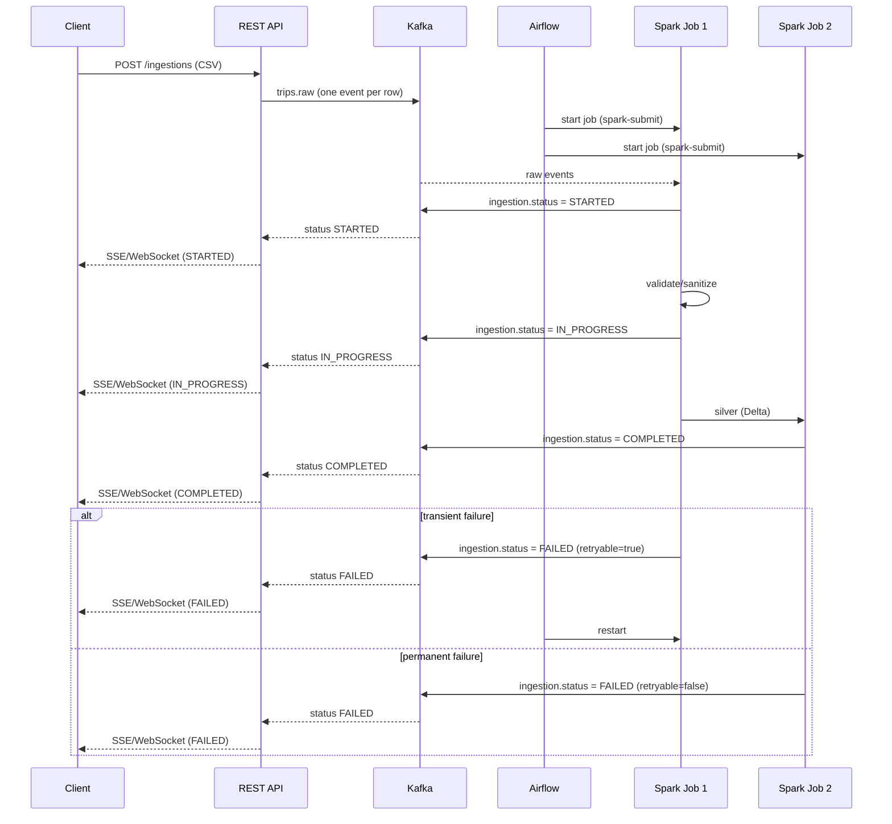

# Solution proposal for the challenge

Based on the challenge requirements and data/software engineering best practices, I propose **a local, containerized implementation** with **two streaming jobs** and **Airflow** as the orchestrator.

## 1) Assumptions and goals

**Main goal**: build an on-demand ingestion process with grouping by similar origin/destination/time, weekly metrics by area (bounding box or region), and ingestion status without polling, scalable to **100 million records** and using **SQL**.

**Notes from the sample analysis (`analysis-trips-gpt-en-us.md`)**:
- There are no **exactly identical** origin+destination pairs in the sample. If grouping requires exact equality, **no groups will form**. Therefore, "similar" must be defined by **spatial proximity** (e.g., geohash/H3 or a radius in meters) and **time bucketing** (e.g., 30-60 min windows).
- Weekly metrics are feasible with weekly or monthly temporal partitioning.
- Region bounding boxes are clear and useful for geospatial filters.

## 2) Proposed architecture (overview)

**Macro flow**:

1. **On-demand ingestion**
   - CSV upload via REST API.
   - Each CSV record becomes **one Kafka event** (`trips.raw`).

2. **Streaming processing (Job 1)**
   - Spark Structured Streaming consumes `trips.raw`.
   - Persists **Bronze (raw)** and **Silver (clean)** in local Delta Lake.

3. **Streaming processing (Job 2)**
   - Spark Structured Streaming reads Silver.
   - Produces **Gold** (aggregates and serving model) and writes to **PostgreSQL + PostGIS**.

4. **No-polling notifications**
   - Status events in `ingestion.status`.
   - API exposes **SSE/WebSocket**.

5. **Coordination**
   - **Airflow** starts and monitors the two streaming jobs.

### Stack (local / containerized)
- **API**: FastAPI + Uvicorn
- **Python management**: Poetry
- **Messaging**: Kafka (KRaft)
- **Processing**: Apache Spark Structured Streaming (PySpark)
- **Lakehouse**: Delta Lake open source (local volume)
- **Orchestration**: Apache Airflow
- **DW/Serving**: PostgreSQL + PostGIS
- **Containerization**: Docker + Docker Compose

### Engineering practices and patterns
- **KISS**: simple, predictable pipelines; two streaming jobs to avoid deep chaining.
- **DRY**: shared parsing/validation rules (e.g., `schema`/`validators` module used by API and Spark).
- **Clean Code**: clear names, small functions, structured logs.
- **Clean Architecture**: separation among `domain` (business rules), `application` (use cases), `infrastructure` (Kafka, DB, Spark).
- **DDD (where it adds clarity)**: entities like `Trip`, `Ingestion`, `Region`, `Datasource` modeled in the domain; no forced DDD without complexity.
- **Automated tests (pytest)**: unit tests for parsing/validation and deduplication, contract tests for Kafka schema, light integration with PostGIS, smoke tests for streaming jobs.

### Observability and distributed logging
- **Structured logs** (JSON) with `ingestion_id`, `trip_id`, `job_id`, and `trace_id`.
- **Distributed tracing** (OpenTelemetry) correlating API -> Kafka -> Spark -> Postgres.
- **Metrics**: throughput, stage latency, error rate, Kafka lag.
- **Alerts**: job failures, SLA breaches, parsing error spikes.

### Code quality and CI
- **Formatting**: `black` + `isort`.
- **Lint**: `ruff`.
- **Types**: `mypy` on domain and parsing modules.
- **Tests**: `pytest` with minimum coverage (e.g., 80%) on critical modules.
- **Local CI**: simple pipeline running `format`, `lint`, `typecheck`, and `pytest`.

### Rationale
- **Kafka**: decoupled, scalable, reliable ingestion with backpressure and replay.
- **Open-source Spark**: robust streaming with checkpoints; safer than ad-hoc Python scripts.
- **Open-source Delta Lake**: ACID, schema evolution, lineage locally.
- **PostgreSQL + PostGIS**: SQL + geospatial queries with high efficiency.
- **Airflow**: orchestrates long-running jobs and provides observability locally.
- **Docker Compose**: fulfills containerization and simplifies local execution.

## 3) On-demand ingestion (CSV -> Kafka events)

### How it works
1. Client uploads CSV to the API (`POST /ingestions`).
2. API parses the CSV **row by row** and publishes **one event per record** to Kafka (`trips.raw`).
3. The event includes metadata for traceability and idempotency.

### Event schema (example)

```json
{
  "ingestion_id": "uuid",
  "row_number": 123,
  "trip_id": "hash",
  "region": "Prague",
  "origin_lon": 14.4973794,
  "origin_lat": 50.0013687,
  "destination_lon": 14.4310948,
  "destination_lat": 50.0405293,
  "datetime": "2018-05-28T09:03:40Z",
  "datasource": "funny_car"
}
```

### Rationale
- One event per row enables parallelism and incremental processing.
- `trip_id` provides **idempotency** and deduplication.
- `ingestion_id` tracks batches and enables status without polling.

## 4) Streaming processing (two jobs)

### Job 1: Kafka -> Bronze + Silver
- **Input**: `trips.raw`.
- **Bronze**: stores raw payload (auditable).
- **Silver**: validates types, drops invalid rows, normalizes dates and coordinates.
- **Output**: Delta `silver_trips`.

**Rationale**: separate raw ingestion from clean data to avoid data loss.

### Job 2: Silver -> Gold + PostGIS
- **Input**: Delta `silver_trips`.
- **Gold**: aggregates (`trip_clusters`, weekly metrics, etc.).
- **PostgreSQL + PostGIS**: final tables for SQL queries.

**Rationale**: isolates business logic and serving, keeping the pipeline stable.

## 5) Coordination with Airflow (local)

- **DAG** with two `spark-submit` tasks (Job 1 and Job 2) running **in parallel**.
- Jobs are **long-running**, so Airflow acts as **orchestrator/monitor** instead of sequencing.
- Airflow metadata uses **Postgres** and `LocalExecutor` for concurrent task execution.
- On failure, Airflow restarts the job with checkpoints intact.

**Rationale**: simulates enterprise workflows without relying on Databricks and avoids blocking streaming tasks.

## 6) Data model (SQL + spatial)

### Main tables

1. `trips`
- `trip_id` (PK)
- `region_id` (FK)
- `origin_geom` (POINT)
- `destination_geom` (POINT)
- `origin_geohash` / `destination_geohash` (optional)
- `datetime`
- `datasource_id` (FK)
- `ingested_at`

2. `regions`
- `region_id`
- `region_name`
- `region_geom` (POLYGON)

3. `datasources`
- `datasource_id`
- `datasource_name`

4. `trip_clusters` (pre-aggregated)
- `cluster_id`
- `origin_cell` (geohash/H3)
- `destination_cell` (geohash/H3)
- `time_bucket`
- `trip_count`
- `iso_week`

### Rationale
- **Geohash/H3** enables proximity grouping.
- `trip_clusters` accelerates frequent queries and reduces compute cost.
- PostgreSQL with spatial indexes (GiST) supports bounding box and region filters.

## 7) Grouping by similar origin/destination/time

### Strategy
- Convert coordinates to **geohash** at precision **7**.
- Define `time_bucket` as a **30-minute window**.
- Group by `(origin_cell, destination_cell, time_bucket)`.

### Rationale
- No exact duplicates in the sample -> distance-based grouping is required.
- Geohash/H3 is efficient and scalable for large volumes.
- Time buckets balance granularity and performance.

## 8) Weekly averages by area

### Strategy
- Compute by **ISO week** via SQL and geospatial filters.
- For bounding box: `ST_Within(origin_geom, ST_MakeEnvelope(...))`.
- For region: `ST_Within(origin_geom, region_geom)`.

### Rationale
- PostGIS is ideal for these queries.
- Weekly aggregations are cheap with temporal partitioning and indexes.

## 9) Ingestion status without polling

### Strategy
- Pipeline publishes events to `ingestion.status`.
- API keeps an **SSE** connection with the client.
- Client receives messages like `STARTED`, `IN_PROGRESS`, `COMPLETED`, `FAILED`.

### Rationale
- Kafka guarantees ordered, scalable delivery.
- SSE/WebSocket reduces backend load and avoids polling.

## 10) Scalability to 100M records

### Applied strategies
- **Partitioning** in Delta Lake by `ingestion_date` and `region`.
- **Z-Ordering** by `datetime` to accelerate time filters.
- **Pre-aggregations** in `trip_clusters`.
- **Incremental ETL** into PostgreSQL (only new data).
- Horizontal Spark scaling when needed.

### Rationale
- Large data requires optimized physical layout.
- Pre-aggregations reduce cost for frequent queries.
- Delta Lake ACID improves reliability and reprocessing.

## 11) Containerization

### Docker Compose
- `api` (FastAPI)
- `kafka` (KRaft or Zookeeper)
- `spark` (master + worker)
- `airflow` (webserver + scheduler)
- `postgres` (PostGIS)

**Rationale**: simple local execution for evaluators and reproducibility.

## 12) Diagram (Mermaid)

### Layered view (subgraphs)

```mermaid
flowchart LR
  subgraph Ingestion[Ingestion Layer]
    client[Client]
    api[REST API]
    client -->|POST /ingestions| api
    api -->|one event per row| kafka[(Kafka)]
  end

  subgraph Processing[Processing Layer]
    job1["Spark Job 1\nKafka -> Bronze/Silver"]
    job2["Spark Job 2\nSilver -> Gold/PostGIS"]
    lake[(Local Delta Lake)]
    kafka --> job1
    job1 -->|Bronze/Silver| lake
    lake --> job2
  end

  subgraph Serving[Serving Layer (SQL)]
    postgis[(PostgreSQL + PostGIS)]
    job2 -->|incremental load| postgis
  end

  subgraph Orchestration[Orchestration]
    airflow[Airflow]
    airflow -->|spark-submit| job1
    airflow -->|spark-submit| job2
  end

  subgraph Status[No-polling Status]
    kafka -->|ingestion.status| api
    api -->|SSE/WebSocket| client
  end
```

### Ingestion status flow (sequence)



## 13) Queries for the bonus questions

### a) Of the two most frequent regions, what is the latest source?

```sql
WITH top_regions AS (
  SELECT region, COUNT(*) AS trips
  FROM trips
  GROUP BY region
  ORDER BY trips DESC
  LIMIT 2
), ranked AS (
  SELECT
    t.region,
    t.datasource,
    t.datetime,
    ROW_NUMBER() OVER (PARTITION BY t.region ORDER BY t.datetime DESC) AS rn
  FROM trips t
  JOIN top_regions tr ON tr.region = t.region
)
SELECT region, datasource, datetime
FROM ranked
WHERE rn = 1;
```

### b) In which regions did the source "cheap_mobile" appear?

```sql
SELECT DISTINCT region
FROM trips
WHERE datasource = 'cheap_mobile'
ORDER BY region;
```

## 14) Conclusion

This solution fully meets the challenge requirements:
- **Kafka** provides on-demand ingestion and async communication.
- **Spark + open-source Delta Lake** enables scalable local ETL.
- **PostgreSQL + PostGIS** covers SQL and geospatial needs.
- **Airflow** coordinates the streaming jobs locally.
- **SSE/WebSocket** removes polling and delivers status in real time.
- **Docker Compose** simplifies local execution for evaluators.

## 15) Local vs Cloud (real scale)

### Local (goal: demonstration)
- Full stack in Docker Compose to show **real architecture** and end-to-end flow.
- Although "heavy" for `trips.csv`, it demonstrates Kafka, Spark, PostGIS, and orchestration mastery.

### Cloud (goal: scale)
- **Kafka**: **AWS MSK** (Managed Streaming for Apache Kafka) or EKS if the DevOps team is strong.
- **Processing**: **Databricks on AWS** with Structured Streaming + Delta Lake.
- **API**: FastAPI on **EKS** with **AWS Load Balancer**.
- **Database**: **Amazon RDS PostgreSQL with PostGIS**.
- **Orchestration**: Databricks Workflows (Jobs) for streams; **MWAA** (managed Airflow) is optional.

**Additional Databricks benefits**:
- **Unity Catalog** for governance, lineage, permissions, and centralized auditing.
- **Delta Live Tables** for declarative pipelines and native validations.
- **Auto-scaling** and **auto-optimization** of clusters.
- **Integrated observability** (jobs, metrics, logs).

**Rationale**: the local architecture mirrors the cloud concepts and patterns, so migration is essentially a change of infrastructure, not design.
